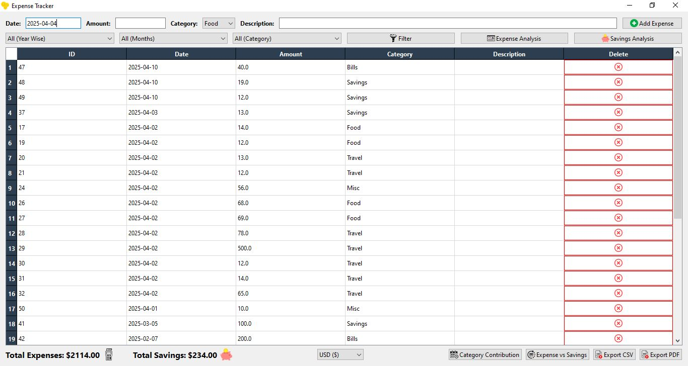
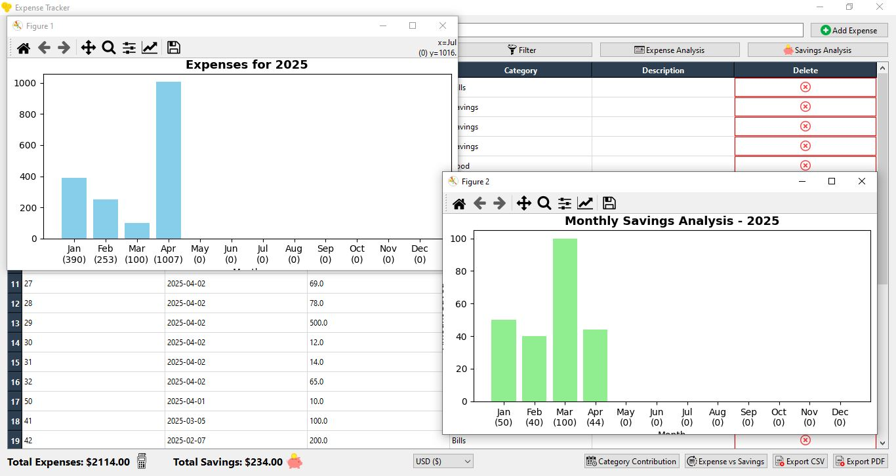
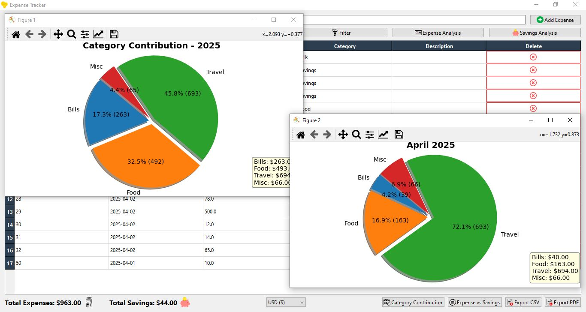
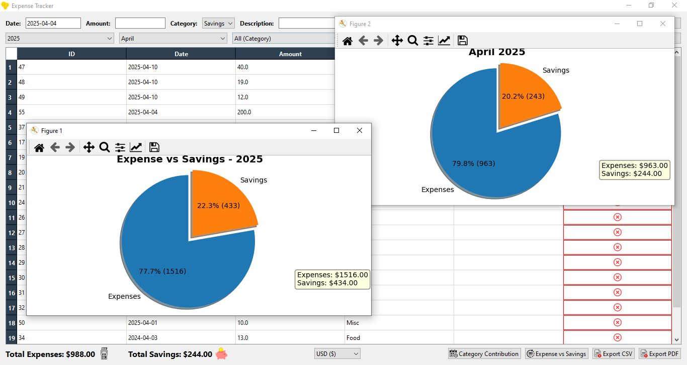

# 💸 Expense Tracker

A modern, personal expense tracking desktop application built using **Python 3.11** and **PySide6**.  
It supports category-wise analysis, monthly savings visualization, multi-currency display, and data exports in **PDF/CSV** formats.  
The sleek UI allows effortless tracking, management, and visualization of expenses and savings.

🎥 **Demo Video**: [expense tracker demo.mp4](./expense%20tracker%20demo.mp4)

---

## 📸 Screenshots

### 📋 Main Expense Table


### 📊 Monthly Expense Analysis


### 💰 Category Contribution


### 📈 Expense vs Savings


---

## 🚀 Features

- 📅 Add and manage expenses with date, amount, category, and description.
- 📊 Interactive bar and pie charts:
  - Expense trend analysis by month.
  - Savings visualization across months.
  - Category contribution (excluding savings).
  - Expense vs Savings summary.
- 💸 Multi-currency support (30+ currencies).
- 📤 Export filtered data to:
  - CSV file
  - PDF report
- 🔍 Filter by:
  - Year
  - Month
  - Category (Expense/Savings or specific)
- ♻️ Persistent storage using SQLite3.
- 📁 Auto-saves currency preference (`config.json`).

---

## 💾 Project Structure

```
Expense Tracker/
│
├── env/                     # Virtual environment (not uploaded)
├── icons/                  # App icons (PNG format)
├── screenshots/            # Demo screenshots used in README
├── main.py                 # Main application file
├── db.py                   # SQLite DB interaction script
├── config.json             # Stores last-used currency
├── expenses.db             # SQLite database file
├── LICENSE                 # License file (GPL-3.0)
├── README.md               # This file
├── requirements.txt        # Dependencies list
└── expense tracker demo.mp4 # Demo video of the project
```

---

## ⚙️ Technologies Used

| Package            | Version  |
|--------------------|----------|
| Python             | 3.11     |
| PySide6            | 6.6.0    |
| matplotlib         | 3.8.0    |
| fpdf               | 1.7.2    |

---

## 🔧 Installation

1. Clone the repository and navigate to the folder:
   ```bash
   git clone https://github.com/Shantanu10z/expense-tracker.git
   cd expense-tracker
   ```

2. Create a virtual environment using Python 3.11:
   ```bash
   python -m venv env
   env\Scripts\activate
   ```

3. Install the dependencies manually one by one due to possible timeout issues:
   ```bash
   pip install PySide6==6.6.0
   pip install matplotlib==3.8.0
   pip install fpdf==1.7.2
   ```

4. Run the app:
   ```bash
   python main.py
   ```

---


## 🙌 Author

[Shantanu Anand](https://github.com/Shantanu10z)

---

> 📌 *Tip: You can update the currency settings directly within the app.*
